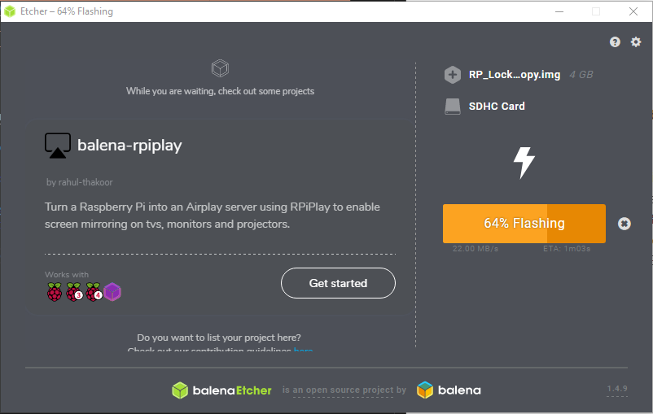
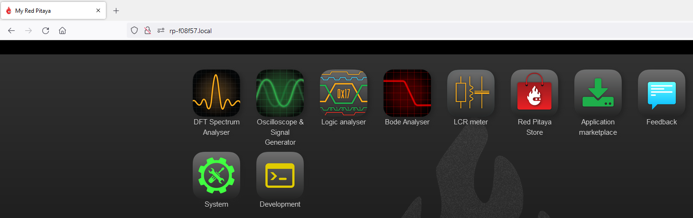
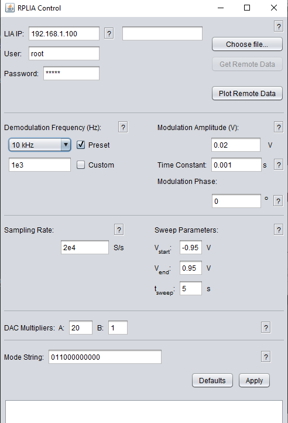
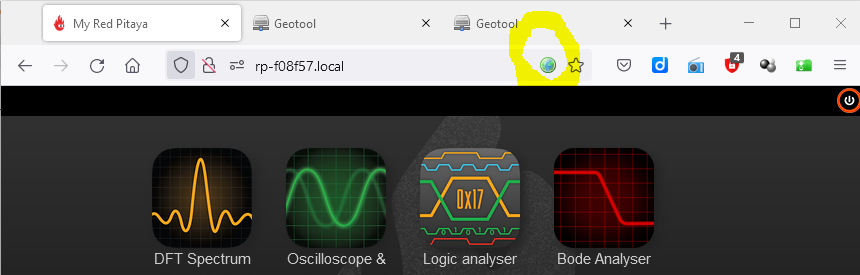
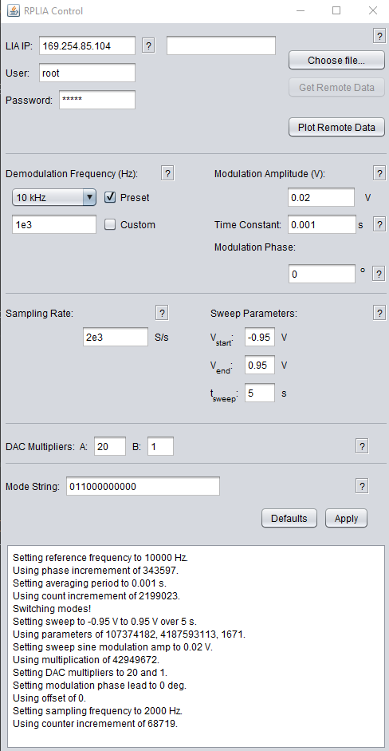
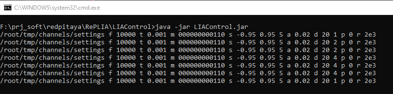
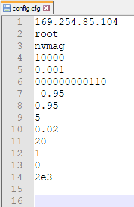
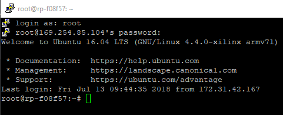

# RePLIA

* [BACK_TO_TOP](./README.md)

##  RePLIA
An open-source high-frequency lock-in amplifier

* [Review of Scientific Instruments: An open-source high-frequency lock-in amplifier](https://aip.scitation.org/doi/10.1063/1.5083797)
    * [LOCAL_COPY](./An_open-source_high-frequency_lock-in_amplifier_1.5083797.pdf)

> ... In this article, we detail an LIA which we have implemented on the STEMlab’s FPGA chip, along with open source29 operational and data transfer software developed specifically for this application. We demonstrate that this device shares many capabilities with more expensive alternatives such as a sweepable internal signal generator, single or dual input/output modes, wave form control, and the ability to increase the number of available inputs and outputs by interfacing across multiple STEMlab units. ...

----
RePLIA Top level diagram

/>

----
RePLIA image for the Redpitaya is 3.9 GB
/>

----

### nikos review
* RePLIA published at 2019
* Up to 50 MHz
* 90 nV/√Hz of input noise
* Creative Commons Attribution 
* The RePLIA has been used for magnetometry
* Power consumption: 4W when idle and <6W during lock-in operation

### How to emulate a noisy input
* nV/√Hz = nanovolt per root Hertz: Spectral noise density

## Preparing the SD-CARD
RePLIA image for the Redpitaya is 3.9 GB

## Connecting to RP
* [Connect to Red Pitaya](https://redpitaya.readthedocs.io/en/latest/quickStart/first.html)

connected to rp-f08f57.local/

RePLIA is not accessed from the browser menu, but from command line via ssh, or with the RePLIA GUI (RePLIA control application)

----

## RePLIA Control application
This is the java aplication running in my windows10 PC. It is not connected (yet) to RedPiya.

### How I made the RePLIA Control application RUN
> * Cloned [RePLIA github](https://github.com/WarwickEPR/RePLIA)
> * Created a dos batch file named run.cmd with content   
> `java -jar LIAControl.jar`
> * Updated Java 
> * Added java to the PATH environmental variable: This [HOW TO](https://www.geeksforgeeks.org/how-to-set-java-path-in-windows-and-linux/) helped me
> * Call the run.cmd from command prompt

### Connect the RePLIA controll application to RedPitaya
* We need to convert the domain name rp-xxxxxx to IP addresss.
* I made that by hovering the mouse over the Geotool icon (small greenish circle icon)

----
Connected and setup is sent to RedPitaya

----

When the Apply button is pressed a command line is executed as below:

### Verify we are using the correct IP address
The file config.cfg is created after the Apply button is pressed. Using a wrong IP address the config.cgf file is not affected, so this is a way to confirm we are using the correct IP address

----

## Connect with Putty

> ... the default user and password are 'root' and 'nvmag'

## Start RePLIA
The comand `./startall.sh` starts the RePLIA, and even though there are some Python error messages, it seems the RePLIA is working:
* Orange LEDs appear as a binary counter clocked at 1Hz
* OUT2 has a sawtooth signal at frequency 1Hz

## First day testing conclusions
- Tested using the provided sd-card image
- RePLIA software inside RedPitaya starts, but reports Python error
- [ ] Find a RepLIA video
- Some indication it works
- Can't make it (yet) to output the reference signal, only the scan sawtooth
- [ ] To understand better the `MODE` of operation and the 14 bits that controll the mode
- GUI to be verified it communicates with the board

