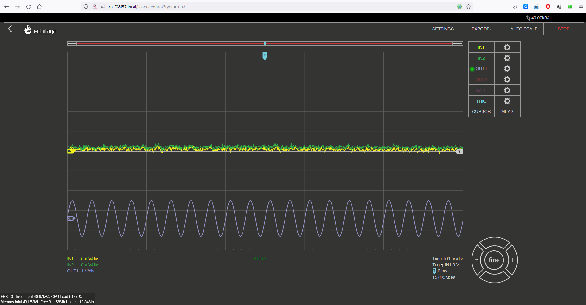
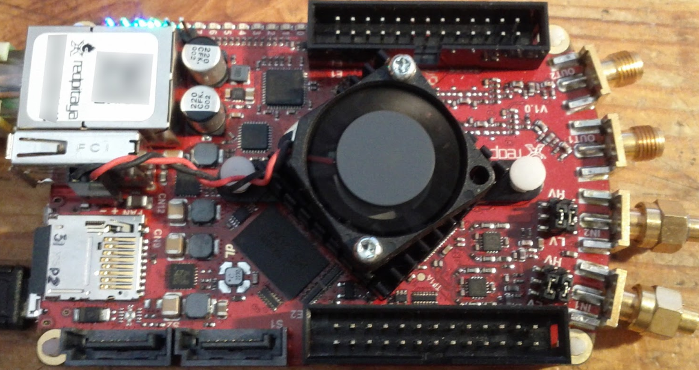

# RedPitaya

* [BACK_TO_TOP](./README.md)

## Download the standard  Red Pitaya SD card image
* Download [ Prepare SD card](https://redpitaya.readthedocs.io/en/latest/quickStart/SDcard/SDcard.html)
* Burn image to sd-card with balenaEtcher

## Connect Ethernet dirctly with PC
It works but it is rather slow and has no Internet

## Test the Oscilloscope/generator app

Very impressive!!

----

## Tasks

## Fan

* [FAN assembly](https://redpitaya.readthedocs.io/en/latest/developerGuide/hardware/125-14/cooling.html)

