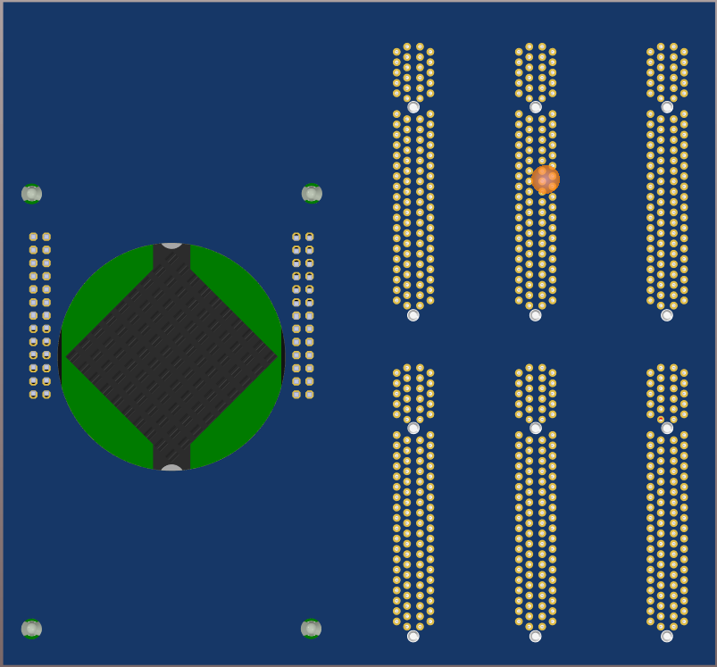

# RedPitaya

* [BACK_TO_TOP](./README.md)


## Download the standard  Red Pitaya SD card image
* Download [ Prepare SD card](https://redpitaya.readthedocs.io/en/latest/quickStart/SDcard/SDcard.html)
* Burn image to sd-card with balenaEtcher


## Connect Ethernet directly with PC
It works but it is rather slow and has no Internet

## Test the Oscilloscope/generator app

Very impressive!!

<p align="center">

</p>

----


## Tasks

## Fan

* [FAN assembly](https://redpitaya.readthedocs.io/en/latest/developerGuide/hardware/125-14/cooling.html)


<p align="center">

</p>

Altium pcbLib `RED-PITAYA-BOTTOM-UP` updated with heatsing PCB opening
<p align="center">

</p>

## Program the FPGA

* Hard way [3.2.2.2. Build FPGA image](https://redpitaya.readthedocs.io/en/latest/developerGuide/software/build/fpga/fpga.html)
* Easy way [Easy FPGA project with Red Pitaya](https://content.redpitaya.com/blog/easy-fpga-project-with-red-pitaya)
* [Neuronal imaging Paper](https://sites.bu.edu/biomicroscopy/files/2019/07/Tutorial-on-using-Red-Pitaya-for-AIM.pdf)
* [Thesis: ADC noise measurement
on FPGA board](https://webthesis.biblio.polito.it/12535/1/tesi.pdf)

----

* FPGA + C [Red-Pitaya-Levitodynamics-Feedback-Project](https://github.com/gerardpc/Red-Pitaya-Levitodynamics-Feedback)

...To load our bitstream to the FPGA 
```
> cat /root/whatever_name_you_like.bit > /dev/xdevcfg
```

```
> gcc some_code.c -o some_code.o -lm
> ./some_code.o
```

If you want to roll back to the normal red pitaya bitstream type:

```
> cat /opt/redpitaya/fpga/fpga_X.XX.bit > /dev/xdevcfg
```

----

* [RedPitayaHelloWorldVHDL](https://github.com/lvillasen/RedPitayaHelloWorldVHDL)

> ...   
> `cat HelloWorld.bin > /dev/xdevcfg`  
> The 8-bit LEDs will display a binary incremental counter at a rate of 1Hz  
>  Reboot the Red Pitaya board to reinstall the permanent bitstream on the Zynq FPGA