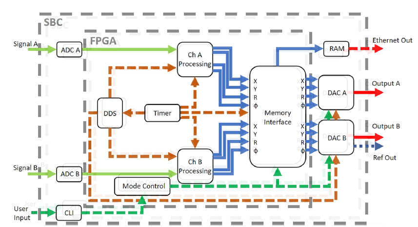

# RedPitayaLIA

* [README](./README.md)

<!-- @import "[TOC]" {cmd="toc" depthFrom=1 depthTo=6 orderedList=false} -->

<!-- code_chunk_output -->

- [RedPitayaLIA](#redpitayalia)
  - [Red Pitaya Lock In](#red-pitaya-lock-in)
    - [Lock-in+PID](#lock-inpid)
    - [Red Pitaya References](#red-pitaya-references)
  - [An open-source high-frequency lock-in amplifier](#an-open-source-high-frequency-lock-in-amplifier)
    - [nikos review](#nikos-review)

<!-- /code_chunk_output -->

 ## Red-Pitaya overview
 
 FPGA board with XILINX at €300, with integrated `[125MHz 14bit ADC] & [125MHz 14bit DAC]`
   * Designed to be used as a low cost and high performance measurening instrument (oscilloscope, analyzers, etc...)
   * Evaluate/Use open source LIA firmware
   * Scientific community and publications
   * Python control via a host
   * A variety of Python libraries
   * Instrument type interfaces PyVISA and more
   * *The effort to create a LIA instrument, is focused to PC Software engineering*

## Red Pitaya Lock In
[RedPitayaLIA](./RedPitayaLIA.md)

Most open source FPGA LIA implementations today (Feb 2022) seem to be based on the Red Pitaya, and specifically on the board [stemlab-125-14](https://redpitaya.com/stemlab-125-14/), which at [RS](https://ie.rs-online.com/web/p/oscilloscopes/1271086) costs €288.00 (€354.24 inc. VAT). RP is used in Scientific publications on Laser spectroscopy...

* [RS Red Pitaya products](https://uk.rs-online.com/web/b/Red-Pitaya/?cm_mmc=IE-PPC-DS3A-_-google-_-2_IE_EN_Suppliers_Red+Pitaya_Exact-_-Red+Pitaya_Pure-_-red+pitaya&matchtype=e&kwd-23777362289&gclid=Cj0KCQiA09eQBhCxARIsAAYRiynxqvpv4DSHIqQS35pyoZMyPBrtmIszIfYnIXlHKd1gOTzV2A6V3f8aArHlEALw_wcB&gclsrc=aw.ds)
* [at elektor](https://www.elektor.com/stemlab-125-14-starter-kit)
* [3D models](https://redpitaya.readthedocs.io/en/latest/developerGuide/hardware/mechSpec.html)
### Lock-in+PID
A complete instrument: Open source XILINX code and PC Python? Software.  
RP communicates to PC via a WEB interface?
* [Red Pitaya Lock-in+PID Application](https://github.com/marceluda/rp_lock-in_pid/)
* [Lock-in+PID](https://marceluda.github.io/rp_lock-in_pid/)

----

### Red Pitaya References
* [An open-source high-frequency lock-in amplifier](https://aip.scitation.org/doi/10.1063/1.5083797) 
* [PyRPL](https://pyrpl.readthedocs.io/en/latest/)  turns your RedPitaya into a powerful DSP device, especially suitable as a digital lockbox and measurement device in quantum optics experiments
* [linien](https://pypi.org/project/linien/) User-friendly locking of lasers using RedPitaya (STEMlab 125-14) that just works
* [SCPI server (MATLAB, LabVIEW, Scilab or Python)](https://redpitaya.com/rtd-iframe/?iframe=https://redpitaya.readthedocs.io/en/latest/appsFeatures/remoteControl/remoteAndProg.html)

##  An open-source high-frequency lock-in amplifier

* [Review of Scientific Instruments: An open-source high-frequency lock-in amplifier](https://aip.scitation.org/doi/10.1063/1.5083797)
    * [LOCAL_COPY](./An_open-source_high-frequency_lock-in_amplifier_1.5083797.pdf)

> ... In this article, we detail an LIA which we have implemented on the STEMlab’s FPGA chip, along with open source29 operational and data transfer software developed specifically for this application. We demonstrate that this device shares many capabilities with more expensive alternatives such as a sweepable internal signal generator, single or dual input/output modes, wave form control, and the ability to increase the number of available inputs and outputs by interfacing across multiple STEMlab units. ...

/>

### nikos review
* published at 2019
* Up to 50 MHz
* 90 nV/√Hz of input noise
* Creative Commons Attribution 
* The RePLIA has been used for magnetometry