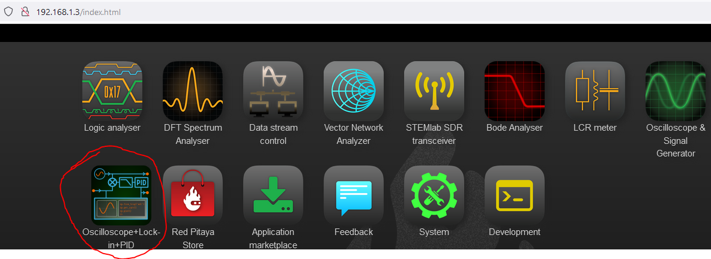
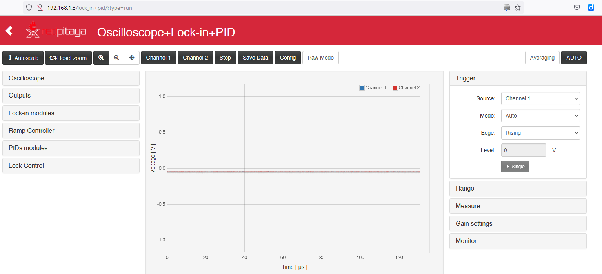
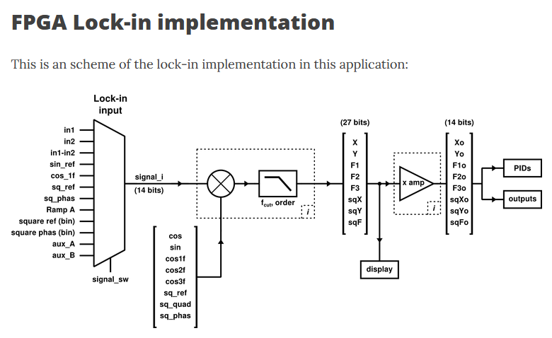

# lock-in-pid

* [BACK_TO_TOP](./README.md)

## Oscilloscope+Lock-In+PID

### Installation
When the Red Pitaya is connected to ethernet:
* Access via the browser is very fast (IP is 192.168.1.3 in my installation)
* Access to the application marketplace is fast and reliable
* Installation of the `Oscilloscope+Lock-In+PID` app works fine
* The `Oscilloscope+Lock-In+PID` App is now installed locally and can run.

----

### RUN
Oscilloscope+Lock-In+PID is running 

----

### FPGA Lock-in implementation
scheme of the lock-in implementation

----

----

## Tasks

- [x] L1. Review [video](https://www.youtube.com/watch?v=330eYE75MYQ) to understand how `Oscilloscope+Lock-In+PID` works
- [ ] L2. Review [github.io/rp_lock-in_pid](https://marceluda.github.io/rp_lock-in_pid/)
- [ ] L3 [scope](https://marceluda.github.io/rp_lock-in_pid/TheApp/instruments/instruments_02_scope/)
- [ ] L4. Review [Lock-in](https://marceluda.github.io/rp_lock-in_pid/TheApp/instruments/instruments_04_lock-in/)
- [ ] L5 Review [Internal Oscillator](https://marceluda.github.io/rp_lock-in_pid/TheApp/instruments/instruments_05_modulation/)
- [ ] L6 Review [ramp generator](https://marceluda.github.io/rp_lock-in_pid/TheApp/instruments/instruments_06_ramp_gen/)
- [ ] L7 Review [Intruments on App](https://marceluda.github.io/rp_lock-in_pid/TheApp/instruments/instruments_01_intro/)
- [ ] L8. Review [Derivated versions](https://marceluda.github.io/rp_lock-in_pid/Derivated/)

