 
 

# LockInAmplifierReview

Review on Lock In Amplifier Technology in order to design a LIA PCB.  
This review had [started](http://www.emboxit.net/niwiki/doku.php?id=lock_in_amplifier) focusing on Analog LIA based on older and newest Analog Devices ICs, and discrete ICs implementations. In year 2021 the focus is changed to FPGA implementations

## Oscilloscope Lock In
watched 22 Feb 2022  

### Mark Sch video
Mark Sch Youtube video [Measuring signals buried in noise with an Oscilloscope](https://www.youtube.com/watch?v=vv-xkNa1Z9s&list=PL3Wrg9iIHo1tMckpT1HD4EOCn3QRuW9JZ&index=4)

Using an external reference, all the noise gets averaged out leaving only the signal in phase with the reference. Similar to how a lock in amplifier works.

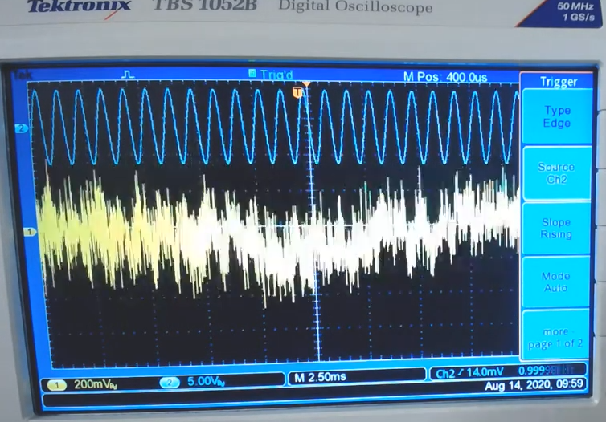

* Chanell 1  oscilloscope is the received signal
* Channel 2 is the reference signal
* Sync in ch2
* Average function applied to ch1

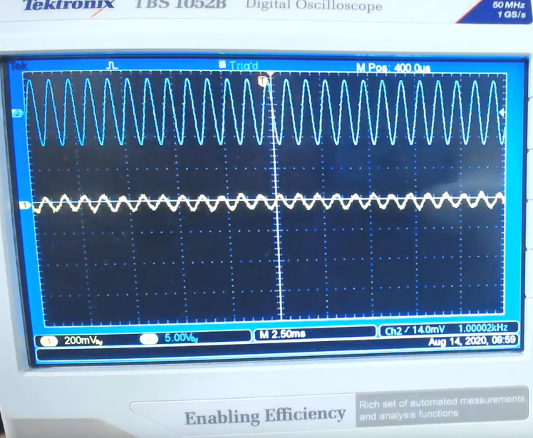

### EEVBlog
thread read 23 Feb 2022  

* [Oscilloscope as a lock-in amplifier (Rigol DS1054Z)](https://www.eevblog.com/forum/projects/oscilloscope-with-trace-averaging-as-a-lock-in-amplifier-(rigol-ds1054z)/)
* book [Lock-in amplifiers: principles and applications (e-edition)](https://www.sites.google.com/site/lockinamplifiers/home)
  * [Local copy](./F:\prj\electronics\LockInAmplifierReview\doc) 

## Red Pitaya Lock In

* [RS Red Pitaya products](https://uk.rs-online.com/web/b/Red-Pitaya/?cm_mmc=IE-PPC-DS3A-_-google-_-2_IE_EN_Suppliers_Red+Pitaya_Exact-_-Red+Pitaya_Pure-_-red+pitaya&matchtype=e&kwd-23777362289&gclid=Cj0KCQiA09eQBhCxARIsAAYRiynxqvpv4DSHIqQS35pyoZMyPBrtmIszIfYnIXlHKd1gOTzV2A6V3f8aArHlEALw_wcB&gclsrc=aw.ds)
* [Red Pitaya Lock-in+PID Application](https://github.com/marceluda/rp_lock-in_pid/)

## References 
* [niwiki](http://www.emboxit.net/niwiki/doku.php?id=lock_in_amplifier)

## Nodes Slideck embedded to readme

----

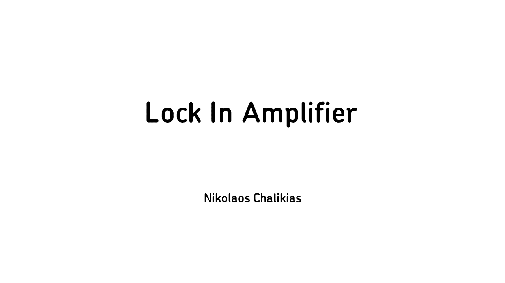

----

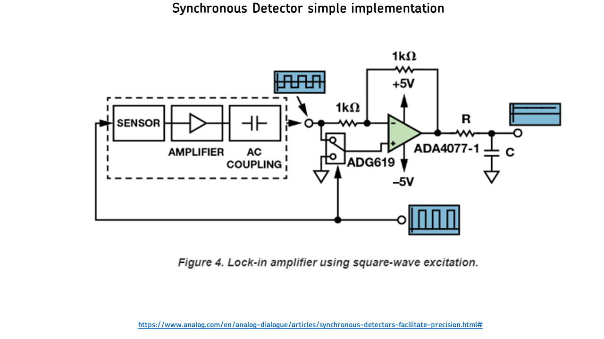

----

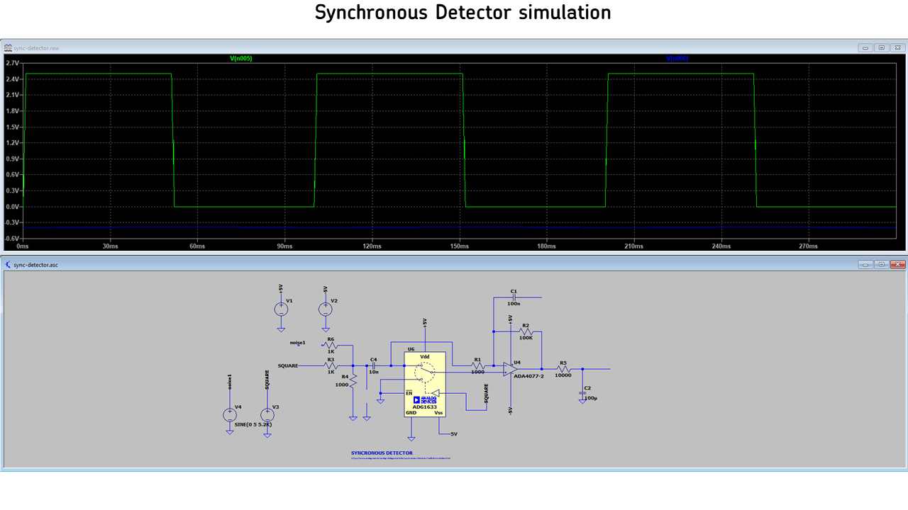

----

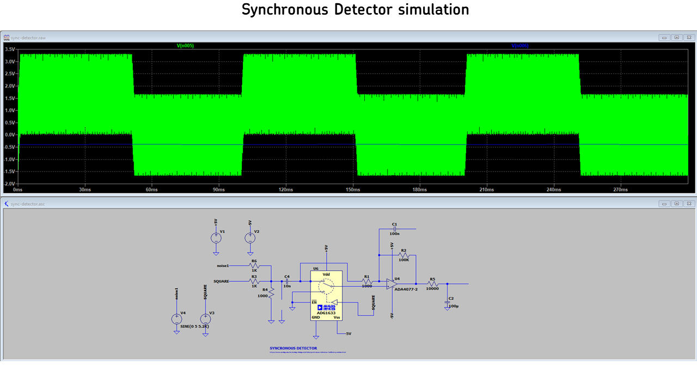

----

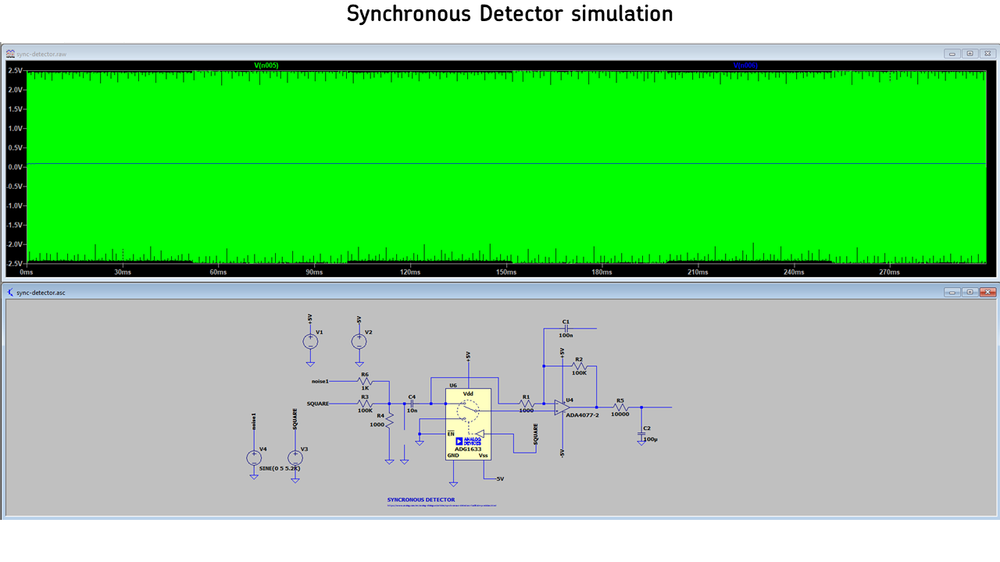

----

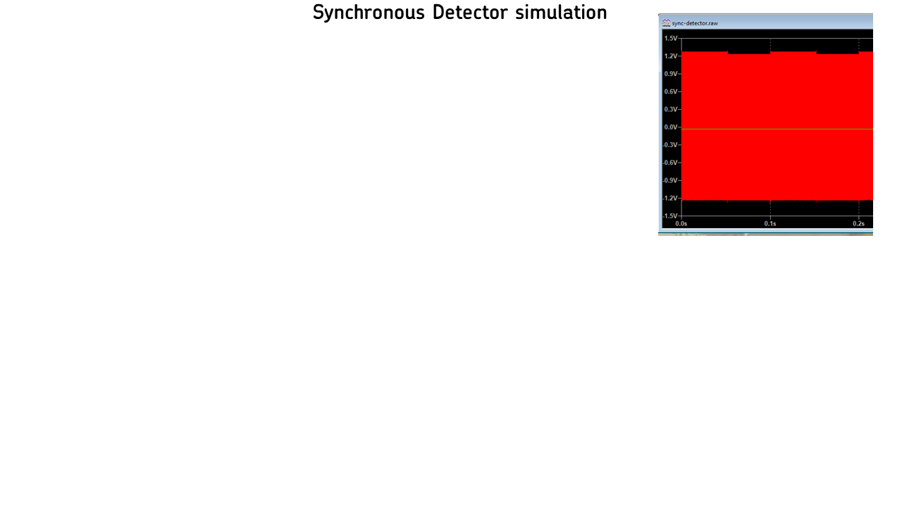

----

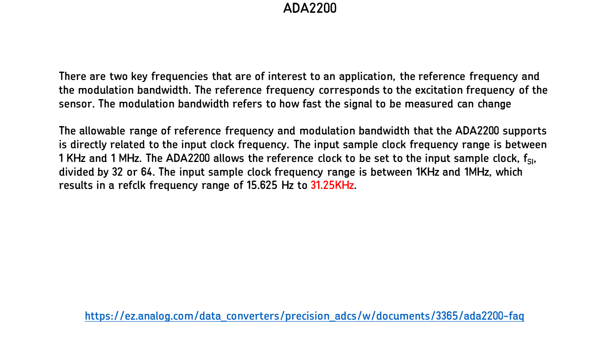

----

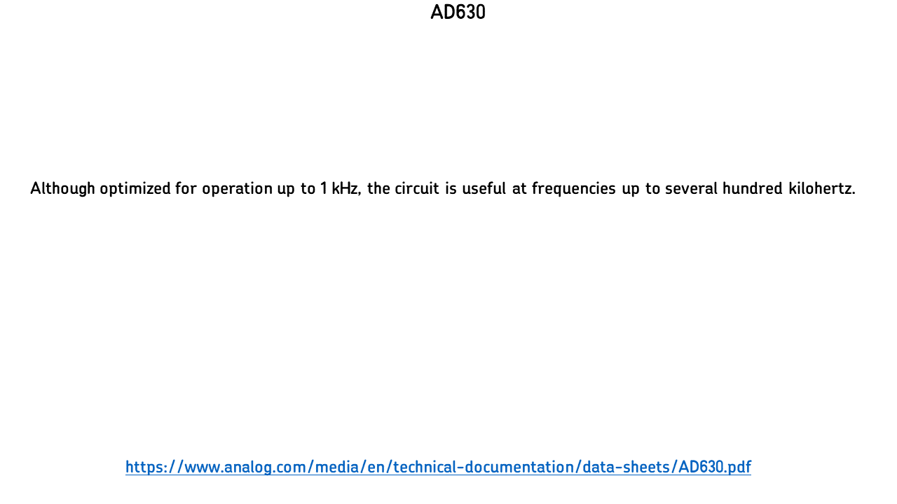

----

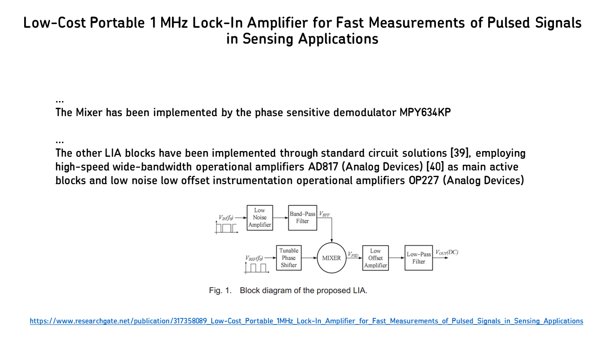