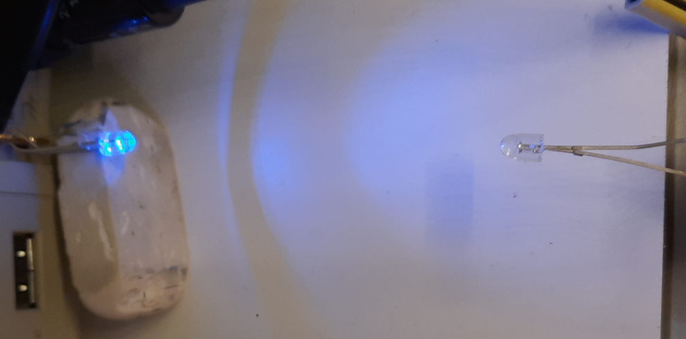
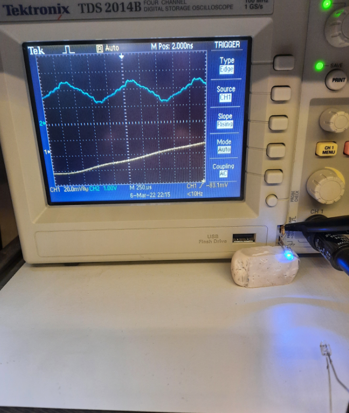
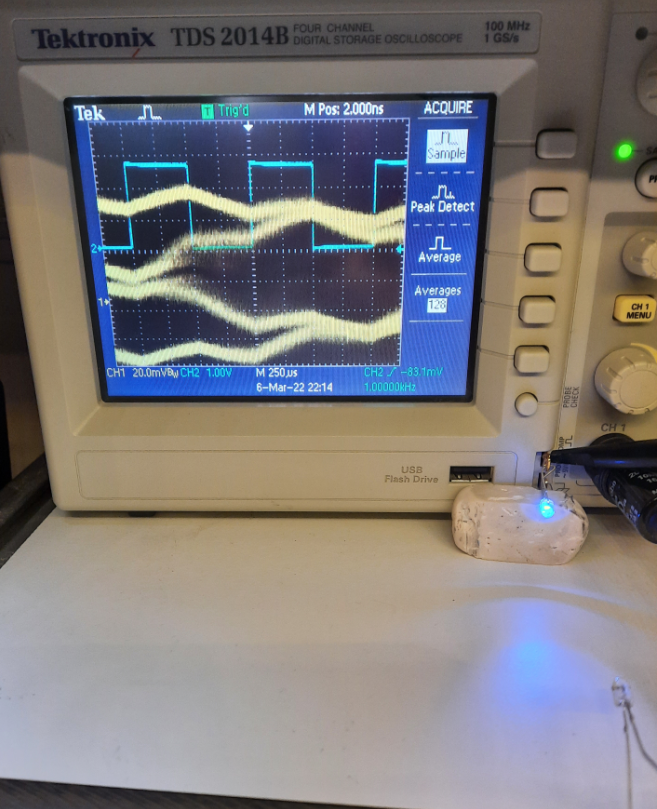
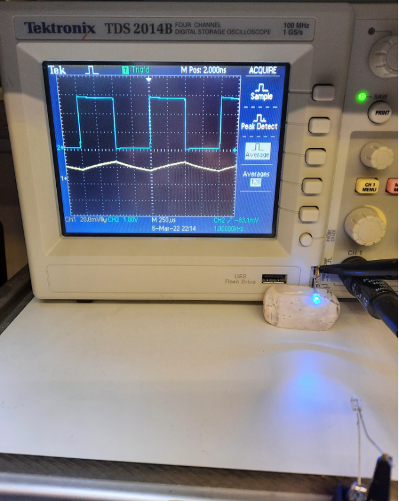

 
 

# Lock_In_Amplifier_Review

* [RedPitayaLIA](./RedPitayaLIA.md)
* [tasks](./tasks.md)

* [RedPitayaLIA](./RedPitayaLIA.md)

Review on Lock In Amplifier Technology in order to design a LIA PCB.

This review had started [in my niwiki](http://www.emboxit.net/niwiki/doku.php?id=lock_in_amplifier) targeting a LIA design to be used with unmodulated Reference frequency up to 10 MHz.  
The focus initally was on Analogue LIA technology, based on older and newest Analog-Devices ICs, and if possible to discrete ICs implementations [like this](http://www.cappels.org/dproj/dlmom/dlmom.html).

 In year 2021/2022, my focus is changing to FPGA implementations  

 A  new consideration arised during the covid19 pandemic: FPGAs, Microcontrollers and a wide range off other ICs have reduced or no availability. Any new design has to take this issue to account. Since FPGA-ICs are almost impossible to purchase, we review **FPGA-Boards**, which have better availabilty than ICs today (Feb 2022) 
 * **DE0-nano** FPGA board with ALTERA, costing €90
   * Need to design/test from scratch an ADC/DAC piggy-back board
   * Need to design/test a LIA in FPGA HDL (VHDL/Verilog)
   * Cost effective and small size
   * *The effort to create a LIA instrument, is focused on precise Analog electronics design, ADC/DAC interfacing to FPGA and HDL design/coding*
 * **Red-Pitaya** FPGA board with XILINX at €300, with integrated `[125MHz 14bit ADC] & [125MHz 14bit DAC]`
   * Designed to be used as a low cost and high performance measurening instrument (oscilloscope, analyzers, etc...)
   * Evaluate/Use open source LIA firmware
   * Scientific community and publications
   * Python control via a host
   * A variety of Python libraries
   * Instrument type interfaces PyVISA and more
   * *The effort to create a LIA instrument, is focused to PC Software engineering*
 * ...

<!-- @import "[TOC]" {cmd="toc" depthFrom=1 depthTo=6 orderedList=false} -->

<!-- code_chunk_output -->

- [Lock_In_Amplifier_Review](#lock_in_amplifier_review)
  - [Input signal requirements](#input-signal-requirements)
    - [Photo-acoustic Laser Gas Analyzer](#photo-acoustic-laser-gas-analyzer)
    - [Biofeedback device](#biofeedback-device)
  - [Oscilloscope Lock In](#oscilloscope-lock-in)
    - [Mark Sch video](#mark-sch-video)
      - [Mark Sch comments](#mark-sch-comments)
      - [My Summary:](#my-summary)
    - [EEVBlog](#eevblog)
    - [Nikos experiment 06 March 2022](#nikos-experiment-06-march-2022)
  - [Red Pitaya Lock In](#red-pitaya-lock-in)
  - [Publications](#publications)
  - [References](#references)
  - [Slideck embedded to readme](#slideck-embedded-to-readme)

<!-- /code_chunk_output -->

## Input signal requirements
### Photo-acoustic Laser Gas Analyzer
* Signal level we get from a Laser Gas Analyzer photoacoustic sensor
* Output of the related preamplifier?
* Reference frequency: 2.5KHz(???)
----
* Preamplifier (Transimpedance Amplifier) Input impedance is 10 MΩ
* Preamplifier (Transimpedance Amplifier) ‘translates’ input current 30pA to 300μV output voltage
* Input to the LIA 14-bit-ADC is 300μV

### Biofeedback device
* Signal level ???
* Reference frequency: 1Hz to 10 MHz

## Oscilloscope Lock In

### Mark Sch video
watched 22 Feb 2022  
Mark Sch Youtube video [Measuring signals buried in noise with an Oscilloscope](https://www.youtube.com/watch?v=vv-xkNa1Z9s&list=PL3Wrg9iIHo1tMckpT1HD4EOCn3QRuW9JZ&index=4)

#### Mark Sch comments
'Using an external reference, all the noise gets averaged out leaving only the signal in phase with the reference. Similar to how a lock in amplifier works.'

#### My Summary: 
The value of this technique: **You only need a digital oscilloscope, to start testing/evaluting the Lock In Amplifier  concept**. No LIA needed, but it is not replicating exactly the  LIA operation.  

Steps:   
* `Chanell-1`: Connect the received signal with AC coupling
* `Channel-2`: Connect the reference signal
* Trigger source: `channel-2`
* Average function applied to `channel-1`
* RMS function applied to averaged `channel-1`

### EEVBlog
Thread read 23 Feb 2022  

* [Oscilloscope as a lock-in amplifier (Rigol DS1054Z)](https://www.eevblog.com/forum/projects/oscilloscope-with-trace-averaging-as-a-lock-in-amplifier-(rigol-ds1054z)/)
* book [Lock-in amplifiers: principles and applications (e-edition)](https://www.sites.google.com/site/lockinamplifiers/home)
  * [Local copy](doc/LockinAmplifiersMlMeade.pdf) 

### Nikos experiment 06 March 2022
2 x blue 3mm LEDs, 
* The 1st LED transmitting, connected to the oscilloscope calibration 1KHz generator output
* The 2nd LED receiving from 6cm distance, connected without any amplifier to the Oscilloscope Input

Oscilloscope probes
* Channel-1: Connected to the receiving LED. Set to maximum amplification: **20mV/div**
* Channel-2: Connected to the transmitting LED, 1V/div, the driving signal is 2.8V

----

* Trigger to the Receving LED, channel-1  
RESULT: Too match noise, can't see any receiving signal

----
* Trigger to the Transmitting signal, channel-2  
* RESULT: As above, too match noise, can't see any receiving signal

----
* Trigger to the Transmitting signal: channel-2 
* From the `ACoUIRE` menu, selected: Averaging (channel-1) with 128 samples  

RESULT: **SUCCESS** THE RECEIVER SIGNAL IS 'EXTRACTED FROM NOISE'
* The receiving signal amplitude is 10mV p-p.

----

## Red Pitaya Lock In
[RedPitayaLIA](./RedPitayaLIA.md)

## Publications
* [FPGA-Based Digital Lock-in Amplifier With High-Precision Automatic Frequency Tracking](https://ieeexplore.ieee.org/document/9129659)

## References 
* [niwiki](http://www.emboxit.net/niwiki/doku.php?id=lock_in_amplifier)
* [A microcontroller-based lock-in amplifier for sub-milliohmresistance measurements Lars E. Bengtsson](http://physics.gu.se/~larsbn/Publikationer/pub4_2012.pdf)
* A microcontroller-based lock-in amplifier for sub-milliohmresistance measurements Lars E. Bengtsson [Local copy](doc/pub4_2012.pdf) 
* [SingularitySurfer-FPGA-Lock-In-Amplifier
](https://github.com/SingularitySurfer/SingularitySurfer-FPGA-Lock-In-Amplifier)

----

##  Slideck embedded to readme

A summary on the Analog-Devices Lock In ICs/options

----

----

----

----

----

----

----

----

----

