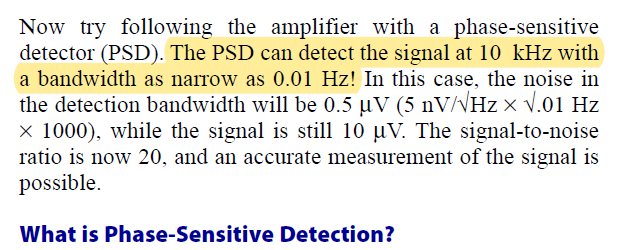
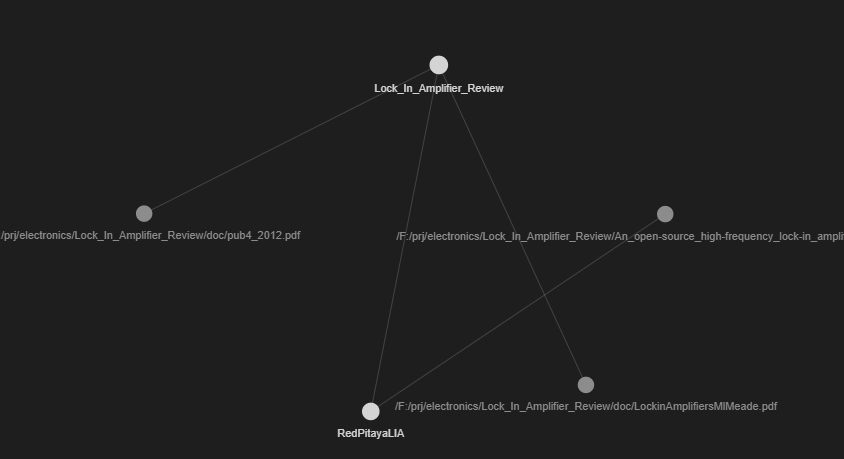

 
 

# Lock_In_Amplifier_Review

## Contents
<!-- @import "[TOC]" {cmd="toc" depthFrom=1 depthTo=6 orderedList=false} -->

<!-- code_chunk_output -->

- [Lock_In_Amplifier_Review](#lock_in_amplifier_review)
  - [Contents](#contents)
  - [Local Links](#local-links)
    - [Tasks](#tasks)
    - [Generic](#generic)
    - [Red Pitaya general](#red-pitaya-general)
    - [LIA with Red Pitaya](#lia-with-red-pitaya)
  - [Overview](#overview)
  - [SRS Standford Research Systems Manual](#srs-standford-research-systems-manual)
  - [Use-cases Input signal requirements](#use-cases-input-signal-requirements)
    - [Photo-acoustic Laser Gas Analyzer](#photo-acoustic-laser-gas-analyzer)
    - [Biofeedback device](#biofeedback-device)
  - [Publications](#publications)
  - [References](#references)
  - [Slideck embedded to readme](#slideck-embedded-to-readme)
  - [Tag cloud](#tag-cloud)

<!-- /code_chunk_output -->

----

## Local Links

### Tasks
* [tasks](./tasks.md)

### Generic
* [oscilloscopeLOCKIN](./oscilloscopeLOCKIN.md)
* [noise](./noise.md)
* [srs](./srs.md)

### Red Pitaya general
* [RedPitaya](./RedPitaya.md)

### LIA with Red Pitaya
* [RedPitayaLIA](./RedPitayaLIA.md)
* [lock-in-PID.md](./lock-in-pid.md)
* [RepLIA](./RePLIA.md)
* [QEPAS Red Pitaya](./qepas_redpitaya.md)

----

## Overview
Review on Lock In Amplifier Technology in order to design/build a LIA PCB.

This review had started [in my niwiki](http://www.emboxit.net/niwiki/doku.php?id=lock_in_amplifier) targeting a LIA design to be used with unmodulated Reference frequency up to 10 MHz.  The focus initally was on Analogue LIA technology, based on older and newest Analog-Devices ICs, and if possible to discrete ICs implementations [like this](http://www.cappels.org/dproj/dlmom/dlmom.html).

----

It seems (in the current stage of our research) the best options are:
* RedPitaya board, being complete with ADC,DAC, and used in scientific publications as LIA
* DE0-Nano board, having good price, small size and Altera FPGA

 
 ## FPGA boards
 
 In year 2021/2022, my focus is changing to FPGA implementations  

 A  new consideration arised during the covid19 pandemic: FPGAs, Microcontrollers and a wide range off other ICs have reduced or no availability. Any new design has to take this issue to account. Since FPGA-ICs are almost impossible to purchase, we review **FPGA-Boards**, which have better availabilty than ICs  (Feb 2022) 
 * **DE0-nano** FPGA board with ALTERA, costing **€90**
   * Need to design/test from scratch an ADC/DAC piggy-back board
   * Need to design/test a LIA in FPGA HDL (VHDL/Verilog)
   * Cost effective and small size
   * *The effort to create a LIA instrument, is focused on precise Analog electronics design, ADC/DAC interfacing to FPGA and HDL design/coding*
 * **Red-Pitaya** FPGA board with XILINX at **€300**, with integrated `[125MHz 14bit ADC] & [125MHz 14bit DAC]`
   * Designed to be used as a low cost and high performance measurening instrument (oscilloscope, analyzers, etc...)
   * Evaluate / Use open source LIA firmware
   * Scientific community and publications
   * Python control via a host
   * A variety of Python libraries
   * Instrument type interfaces PyVISA and more
   * *The effort to create a LIA instrument, is focused to PC Software engineering*
 

## SRS Standford Research Systems Manual
* SRS [Application Note #3: About Lock-In Amplifiers](https://web.physics.indiana.edu/courses/p451/background_info/SRS_Lock-In_Amplifiers.pdf)

* **Pages 1 to 9 have a very good explanation on LIA operation and considerations.**   
* Then in pages 10 to 78 is the user manual for the MODEL SR530 LOCK-IN AMPLIFIER

> local pdf copy with HIGHLIGHTS for pages 1-9

----

## Use-cases Input signal requirements
### Photo-acoustic Laser Gas Analyzer
* Signal level we get from a QEPAS Laser Gas Analyzer photoacoustic sensor: 30pA
* Max Output of the  preamplifier: 300 μV
* Min Output of the  preamplifier: ??? μV
* Reference frequency: 2.5KHz

----
> * Preamplifier (Transimpedance Amplifier) Input impedance is **10 MΩ**
> * Preamplifier (Transimpedance Amplifier) ‘translates’ input current **30pA** to 300μV output voltage
> * Input to the LIA 14-bit-ADC is **300μV**

----

### Biofeedback device
* Signal level: Unknown
* Reference frequency: 1Hz to 10 MHz

## Publications
* [FPGA-Based Digital Lock-in Amplifier With High-Precision Automatic Frequency Tracking](https://ieeexplore.ieee.org/document/9129659)

## References 
* [niwiki](http://www.emboxit.net/niwiki/doku.php?id=lock_in_amplifier)
* [A microcontroller-based lock-in amplifier for sub-milliohmresistance measurements Lars E. Bengtsson](http://physics.gu.se/~larsbn/Publikationer/pub4_2012.pdf)
* A microcontroller-based lock-in amplifier for sub-milliohmresistance measurements Lars E. Bengtsson [Local copy](doc/pub4_2012.pdf) 
* [SingularitySurfer-FPGA-Lock-In-Amplifier
](https://github.com/SingularitySurfer/SingularitySurfer-FPGA-Lock-In-Amplifier)

----

##  Slideck embedded to readme

A summary on the Analog-Devices Lock In ICs/options

----

----

----

----

----

----

----

----

----

## Tag cloud

