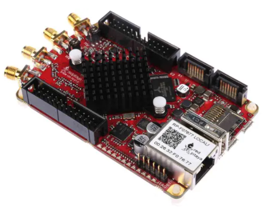
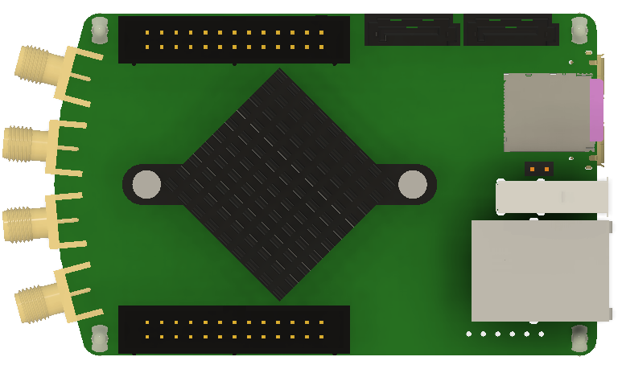

 
 

# Lock_In_Amplifier_Review

Review on Lock In Amplifier Technology in order to design a LIA PCB.

This review had started [in my niwiki](http://www.emboxit.net/niwiki/doku.php?id=lock_in_amplifier) targeting a LIA design to be used with unmodulated Reference frequency up to 10 MHz.  
The focus initally was on Analogue LIA technology, based on older and newest Analog-Devices ICs, and if possible to discrete ICs implementations [like this](http://www.cappels.org/dproj/dlmom/dlmom.html).

 In year 2021/2022 the focus is changing to FPGA implementations  
 * DE0-nano FPGA board with Altera, costing €90
   * Need to design from scratch an ADC/DAC piggy-back board, and create VHDL/Verilog LIA
 * Pitaya FPGA board with XILINX at €300, with integrated `[125MHz 14bit ADC] & [125MHz 14bit DAC]`
   * Evaluate/Use open source LIA firmware 
 * ...

## Oscilloscope Lock In

### Mark Sch video
watched 22 Feb 2022  
Mark Sch Youtube video [Measuring signals buried in noise with an Oscilloscope](https://www.youtube.com/watch?v=vv-xkNa1Z9s&list=PL3Wrg9iIHo1tMckpT1HD4EOCn3QRuW9JZ&index=4)

#### Mark Sch comments
'Using an external reference, all the noise gets averaged out leaving only the signal in phase with the reference. Similar to how a lock in amplifier works.'

#### My Summary: 
The value of this technique: **You only need a digital oscilloscope, to start testing/evaluting the Lock In Amplifier  concept**. No LIA needed, but it is not replicating exactly the  LIA operation.  

Steps:   
* `Chanell-1`: Connect the received signal with AC coupling
* `Channel-2`: Connect the reference signal
* Trigger source: `channel-2`
* Average function applied to `channel-1`
* RMS function applied to averaged `channel-1`

### EEVBlog
thread read 23 Feb 2022  

* [Oscilloscope as a lock-in amplifier (Rigol DS1054Z)](https://www.eevblog.com/forum/projects/oscilloscope-with-trace-averaging-as-a-lock-in-amplifier-(rigol-ds1054z)/)
* book [Lock-in amplifiers: principles and applications (e-edition)](https://www.sites.google.com/site/lockinamplifiers/home)
  * [Local copy](doc/LockinAmplifiersMlMeade.pdf) 

## Red Pitaya Lock In
Most open source FPGA LIA implementations today (Feb 2022) seem to be on the Red Pitaya, and specifically on the board [stemlab-125-14](https://redpitaya.com/stemlab-125-14/), which at [RS](https://ie.rs-online.com/web/p/oscilloscopes/1271086) costs €288.00 (€354.24 inc. VAT)

* [RS Red Pitaya products](https://uk.rs-online.com/web/b/Red-Pitaya/?cm_mmc=IE-PPC-DS3A-_-google-_-2_IE_EN_Suppliers_Red+Pitaya_Exact-_-Red+Pitaya_Pure-_-red+pitaya&matchtype=e&kwd-23777362289&gclid=Cj0KCQiA09eQBhCxARIsAAYRiynxqvpv4DSHIqQS35pyoZMyPBrtmIszIfYnIXlHKd1gOTzV2A6V3f8aArHlEALw_wcB&gclsrc=aw.ds)
* [at elektor](https://www.elektor.com/stemlab-125-14-starter-kit)
* [Red Pitaya Lock-in+PID Application](https://github.com/marceluda/rp_lock-in_pid/)
* [3D models](https://redpitaya.readthedocs.io/en/latest/developerGuide/hardware/mechSpec.html)

## References 
* [niwiki](http://www.emboxit.net/niwiki/doku.php?id=lock_in_amplifier)
* [A microcontroller-based lock-in amplifier for sub-milliohmresistance measurements Lars E. Bengtsson](http://physics.gu.se/~larsbn/Publikationer/pub4_2012.pdf)
* A microcontroller-based lock-in amplifier for sub-milliohmresistance measurements Lars E. Bengtsson [Local copy](doc/pub4_2012.pdf) 

##  Slideck embedded to readme

----

----

----

----

----

----

----

----

----

