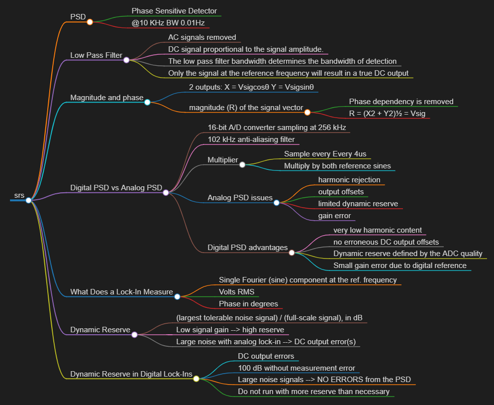

# srs

An overview and mindmap of the `SRS_Lock-In_Amplifiers_HIGHLIGHTS.pdf`

* [BACK_TO_TOP](./README.md)

mindmap created with `Markdown Mindmap Preview' VSC extension

## PSD
The PSD can detect the signal at 10 kHz with a bandwidth as narrow as 0.01 Hz!

### Phase Sensitive Detector 
### @10 KHz BW 0.01Hz

## Low Pass Filter
If the PSD output is passed through a low pass filter, the AC signals are removed.

### AC signals  removed

### DC signal proportional to the signal amplitude.
### The low pass filter bandwidth determines the bandwidth of detection
### Only the signal at the reference frequency will result in a true DC output 

## Magnitude and phase
### 2 outputs: X = Vsigcosθ Y = Vsigsinθ
### magnitude (R) of the signal vector
#### Phase dependency is removed 
#### R = (X2 + Y2)½ = Vsig

## Digital PSD vs Analog PSD
The amplified signal is converted to digital
form using a 16-bit A/D converter sampling at 256 kHz. The
A/D converter is preceeded by a 102 kHz anti-aliasing filter to
prevent higher frequency inputs from aliasing below 102 kHz

The overall performance of a lock-in amplifier is largely
determined by the performance of its phase sensitive
detectors. In virtually all respects, the digital PSD outperforms
its analog counterparts.

### 16-bit A/D converter sampling at 256 kHz

### 102 kHz anti-aliasing filter

### Multiplier 

#### Sample every Every 4us
#### Multiply by both reference sines

### Analog PSD issues
Analog PSDs (both square wave and
linear) have many problems associated with them. The main
problems are harmonic rejection, output offsets, limited
dynamic reserve, and gain error.

#### harmonic rejection
#### output offsets
#### limited dynamic reserve 
####  gain error

### Digital  PSD advantages
Analog PSDs (both square wave and
linear) have many problems associated with them. The main
problems are harmonic rejection, output offsets, limited
dynamic reserve, and gain error.

#### very low harmonic content
Because the reference sine
waves are computed to 20 bits of accuracy, they have very low
harmonic content. In fact, the harmonics are at the −120 dB
level!

#### no erroneous DC output offsets
Output offset is a problem because the signal of interest is a
DC output from the PSD, and an output offset contributes to
error and zero drift. The offset problems of analog PSDs are
eliminated using the digital multiplier. There are no erroneous
DC output offsets from the digital multiplication of the signal
and reference. In fact, the actual multiplication is virtually
error free.

#### Dynamic reserve defined by the ADC quality
In the digital lock-in, dynamic reserve is limited by the quality
of the A/D conversion

####  Small gain error due to digital reference 
The digital reference sine wave has a precise amplitude and never
changes. This avoids a major source of gain error common to
analog lock-ins.

## What Does a Lock-In Measure
A lock-in amplifier, because it multiplies the signal with a
pure sine wave, measures the single Fourier (sine) component
of the signal at the reference frequency

Lock-in amplifiers, as a general rule, display the input signal
in volts rms

Phase is always reported in degrees.

### Single Fourier (sine) component at the ref. frequency
### Volts RMS
### Phase  in degrees

## Dynamic Reserve
The traditional definition of dynamic reserve is the ratio of the
largest tolerable noise signal to the full-scale signal, expressed
in dB.
### (largest tolerable noise signal) / (full-scale signal), in dB

----

$$
x = \frac { largest tolerable noise signal} { full-scale signal } (dB)
$$

----

To achieve high reserve, the input signal gain is set very low
so the noise is not likely to overload. This means that the
signal at the PSD is also very small

* [Mathpix Markdown Syntax Reference](https://mathpix.com/docs/mathpix-markdown/syntax-reference)

### Low signal gain --> high reserve

In an analog lock-in, large noise
signals almost always disturb the measurement in some way.
The most common problem is a DC output error caused by the
noise signal. This can appear as an offset or as a gain error
### Large noise with analog lock-in --> DC output error(s)

## Dynamic Reserve in Digital Lock-Ins
The SR810, SR830 and SR850, with their digital phase
sensitive detectors, do not suffer from DC output errors
caused by large noise signals. The dynamic reserve can be
increased to above 100 dB without measurement error. Large
noise signals do not cause output errors from the PSD. The
large DC gain does not result in increased output drift.

virtually all signal sourceswill have a noise floor which will dominate the lock-in output
noise

In general, do not run with more reserve than
necessary

### DC output errors
### 100 dB without measurement error
### Large noise signals --> NO ERRORS from the PSD
### Do not run with more reserve than necessary

